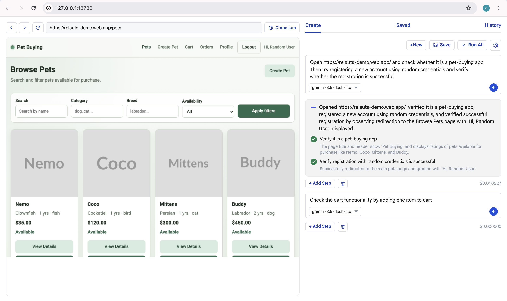
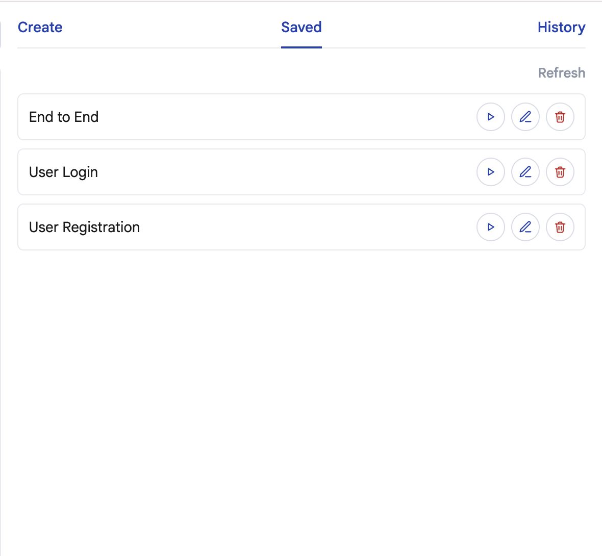
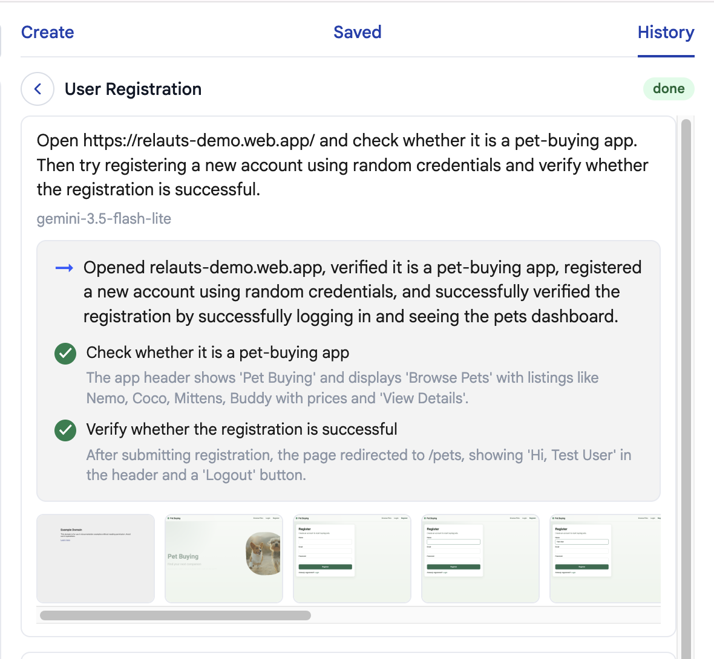

# Spotcheck

Spotcheck lets people with no coding skills build and run Playwright browser tests by typing what they want in plain English.



Create a workflow on the right. Watch the live browser on the left.

<table>
  <tr>
    <td align="center" valign="top" width="50%">
      
      <p><strong>Saved</strong> — Run a saved workflow. Each one runs in its own browser session. You can open and watch them on their own.</p>
    </td>
    <td align="center" valign="top" width="50%">
      
      <p><strong>History</strong> — Results and screenshots of saved runs.</p>
    </td>
  </tr>
</table>

## Quick start

Needs Node.js `>=18.18.0`.

```bash
mkdir my-spotcheck
cd my-spotcheck
npx @relauts/spotcheck
```

Open `http://127.0.0.1:18733`. Paste your Gemini API key when the UI asks.

This command downloads the UI and service, copies config, and starts both.

## License

Spotcheck is free software: you can redistribute it and/or modify it under
the terms of the GNU Affero General Public License as published by the
Free Software Foundation, either version 3 of the License, or (at your
option) any later version.

See `LICENSE` and `NOTICE`.

The names Relauts and Spotcheck are trademarks of Relauts Pvt. Ltd.
