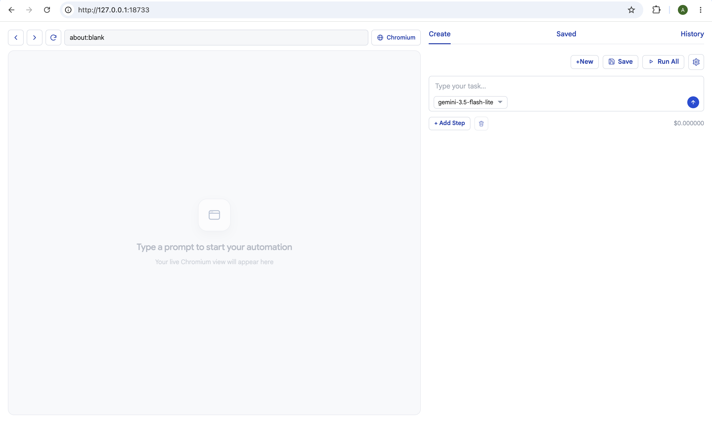

# Spotcheck (beta)

Spotcheck lets people with no coding skills build and run Playwright browser tests by typing what they want in plain English. Gemini is currently supported, so you can start testing with a free API key.



<table border="1" width="100%">
  <tr>
    <th><strong>Create tab</strong></th>
  </tr>
  <tr>
    <td align="center">
      
      <p>Create a workflow on the right. Watch the live browser on the left.</p>
    </td>
  </tr>
</table>

<table border="1" width="100%">
  <tr>
    <th width="50%"><strong>Saved tab</strong></th>
    <th width="50%"><strong>History tab</strong></th>
  </tr>
  <tr>
    <td align="center" valign="top" width="50%">
      
      <p>Run a saved workflow. Each one runs in its own browser session. You can open and watch them on their own.</p>
    </td>
    <td align="center" valign="top" width="50%">
      
      <p>Results and screenshots of saved runs.</p>
    </td>
  </tr>
</table>

## Quick start

### One-liner (recommended)

Installs Node if needed, sets up `~/spotcheck`, and starts the app.

**macOS / Linux**

```bash
curl -fsSL https://raw.githubusercontent.com/relauts/spotcheck/main/scripts/install.sh | bash
```

**Windows (PowerShell)**

```powershell
irm https://raw.githubusercontent.com/relauts/spotcheck/main/scripts/install.ps1 | iex
```

Open `http://127.0.0.1:18733`. Paste your Gemini API key when the UI asks.

Later, just type:

```bash
spotcheck
```

### Already have Node.js?

Needs Node.js `>=18.18.0`.

```bash
mkdir my-spotcheck
cd my-spotcheck
npx @relauts/spotcheck
```

This downloads the UI and service, copies config, and starts both.

## License

Spotcheck is free software: you can redistribute it and/or modify it under
the terms of the GNU Affero General Public License as published by the
Free Software Foundation, either version 3 of the License, or (at your
option) any later version.

See `LICENSE` and `NOTICE`.
